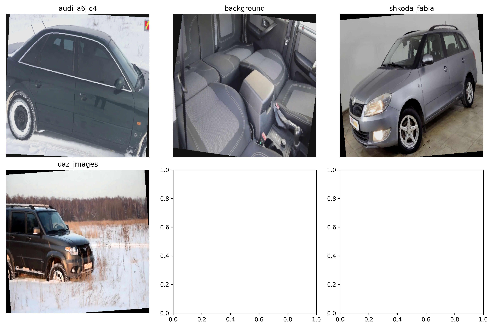
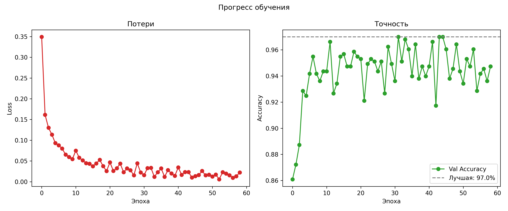
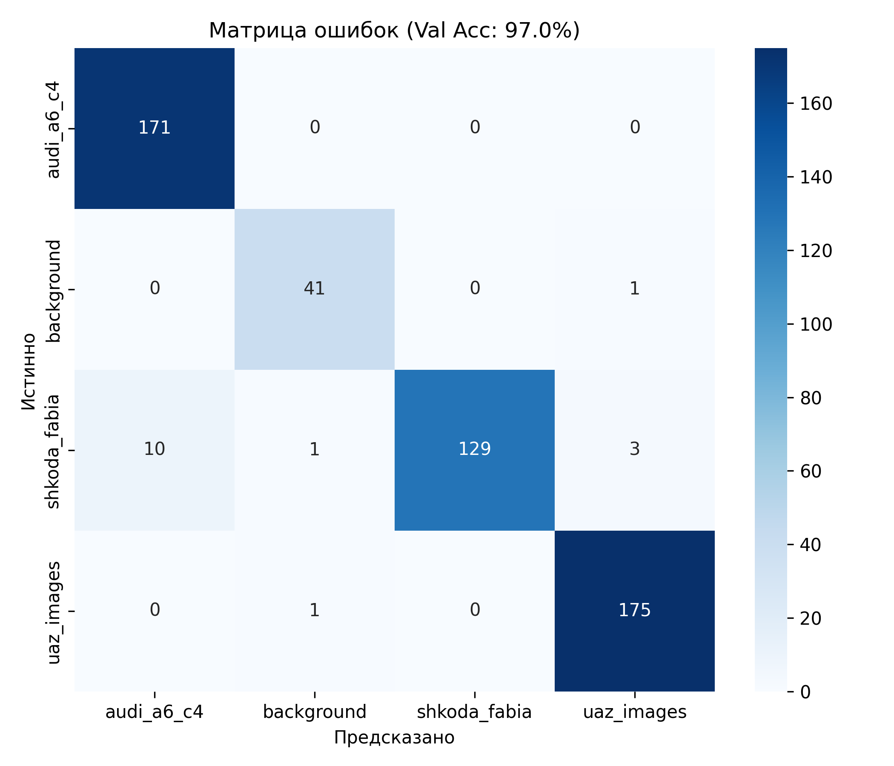
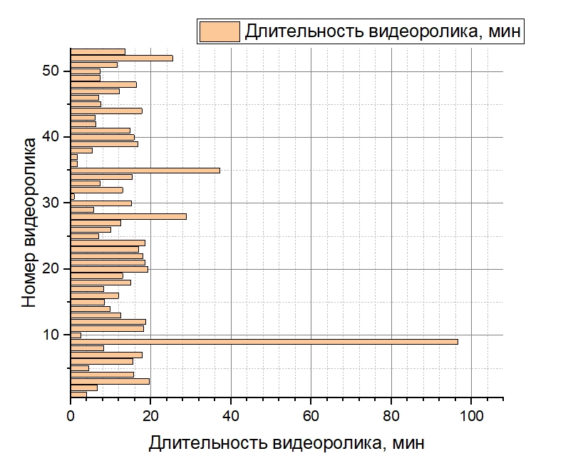
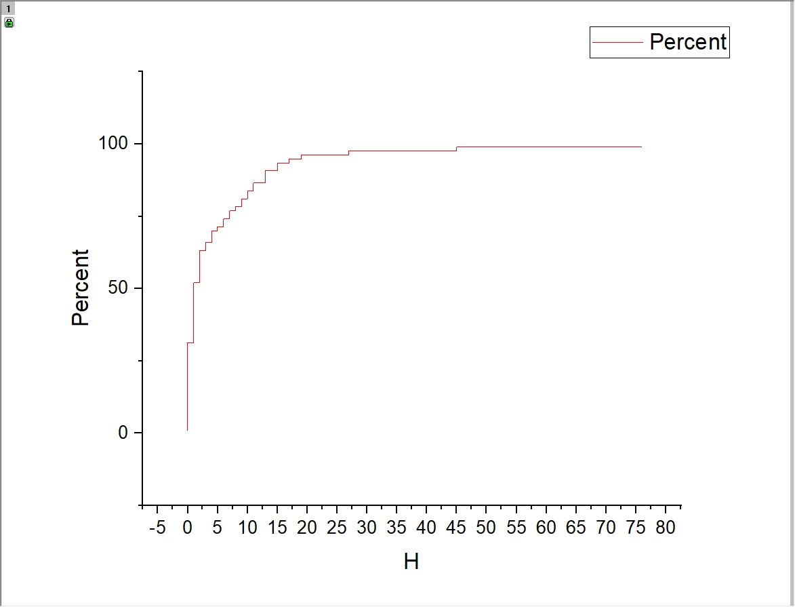
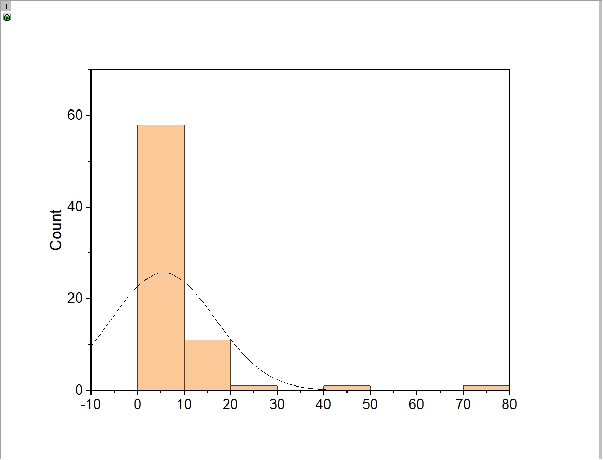
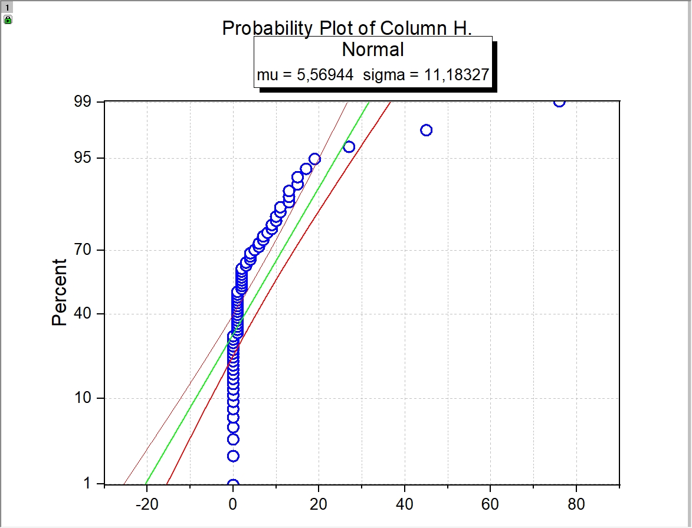

# Классификация автомобилей на видео
**Дипломный проект: распознавание автомобилей на видео с GPS-привязкой**  
  
  
  
  


---

## Этап № 3. DS. Парсинг, подготовка и обучение модели
---

### 1. Подготовка данных

- **Датасет**: 6283 изображения (3 целевых класса) + **>3500 фоновых** (background)
- Датасет расположен здесь: https://github.com/admiralbanan/Car_detection (без `background`)   
- **Классы**: `audi_a6_c4`, `shkoda_fabia`, `uaz_images`, `background`  
- **Сплиты**:  
  - `train`: 5623  
  - `val`: 490  
  - `test`: 170  
- **Формат**: JPEG
- **Предобработка**:  
  - `Resize(500×500)`  
  - Нормализация (ImageNet)  
  - Аугментация: флип, ротация, ColorJitter  
- **Фон (background)**: >3.5 ГБ, **не загружается в репозиторий** (мусорные кадры, ошибки классификации) — используется локально для дообучения.

> **Структура**: `dataset/train|val|test/[class]/`

#### Примеры изображений из датасета


**Описание**:  
- По одному примеру из каждого класса (`audi_a6_c4`, `shkoda_fabia`, `uaz_images`, `background`)  
- Изображения приведены к размеру **500×500**, нормализованы по ImageNet  
- Класс `background` — кадры без целевых объектов (ошибки предыдущих итераций)  
- **Вывод**: данные визуально чистые, классы хорошо разделимы, фон разнообразный


---

### 2. Обучение модели (итеративный процесс)

Использовалась **EfficientNet-B0** (предобученная на ImageNet).  
**4 итерации улучшения**:

| Итерация | Val Accuracy | Действие |
|---------|--------------|--------|
| 1       | 72.93%       | Базовое обучение |
| 2       | 87.91%       | Добавлены фоновые кадры из ошибок |
| 3       | 96.62%       | Увеличена аугментация, LR снижен |
| 4       | **99.27%**   | Финальная модель, early stopping |

> **Код обучения**: [`train_efficientnet_final.py`](train_efficientnet_final.py)  
> **Лучшая модель**: [`best_model_with_classes.pth`](best_model_with_classes.pth) *(с метаданными классов)*

---

### 3. Результаты обучения

#### График прогресса
  
*Потери резко падают, точность достигает 96.62%, после повторного обучения достигается точность 99.27%*

#### Матрица ошибок (валидация)
  


#### 4. Статистический анализ ошибок классификации (OriginPro 2021)

#### 4.1 Гистограмма длительности видеороликов


**Анализ**:  
- Основная масса видео — **до 20 минут**  
- Самое длинное — **98 минут** (трасса)  
- Короткие ролики (~10 мин) — городские, загородные поездки  
- Распределение **мультимодальное** — отражает разные сценарии съёмки (освещенность, время года, итд.)

---

#### 4.2 Распределение количества ошибок классификации на видео (Percent)


**Анализ**:  
- **90% видео** имеют **менее 5% ошибок**  
- **99% видео** — менее 15% ошибок  
- Резкий рост до 100% в начале — **единичные видео с полным провалом** (ночь, дождь, размытие)  
- После 15% — плато  
- **Вывод**: модель **стабильно работает** на большинстве роликов, провалы — редкие экстремальные случаи.

---

#### 4.3 Гистограмма количества ошибок классификации на видео


**Анализ**:  
- **Пик в 0–10 ошибок** — большинство видео классифицируются **почти идеально**  
- Высокий столбец слева — **почти 60 видео с 0-10 ошибок**  
- Длинный правый хвост до 80 — **единичные сложные ролики**  
- **Вывод**: модель **практически не ошибается** на типичных видео, ошибки сосредоточены в сложных условиях.

---

#### 4.4 Probability Plot (Q-Q Plot) — проверка нормальности распределения ошибок классификации


**Анализ**:  
- **Центральная часть** (до ±20 ошибок) — **линейная**, ошибки распределены **почти нормально**  
- **Хвосты отклоняются**:  
  - **Левый**: меньше ожидаемого — нет видео с отрицательным числом ошибок (очевидно)
  - **Правый**: больше ожидаемого — **тяжёлый хвост**, есть видео с аномально большим числом ошибок  
- Параметры: μ ≈ 5.57, σ ≈ 11.18  
- **Вывод**: **ошибки не строго нормальны**, но **центр стабилен** — можно использовать среднее/медиану для оценки типичной ошибки.


### 6.Классификация кадров видео с помощью обученной модели: `find_cars_v0p3_all_converted.py`

> **Код**: [`find_cars_v0p3_all_converted.py`](find_cars_v0p3_all_converted.py)

**Что делает**:  
Обрабатывает `.mp4` файлы в папке `try_2/`, находит целевые авто (`audi`, `shkoda`, `uaz`) с **уверенностью ≥ 95%**, сохраняет кадры:
```
try_2/[название_видео]/
├── audi/
├── shkoda/
└── uaz/
```

- **Шаг**: каждый 60-й кадр  
- **Модель**: обучена на **500×500** → `Resize(500,500)`  
- **Выход**: `[видео]_f000123_c0.98.jpg`  
- **Доп. функция**: `clean_empty_dirs()` — удаляет пустые папки (это нужно для дальнейшей статистики, собственно, она уже была показана выше)

**Используется для**:  
- Тестирования модели на **реальных видео**  
- Сбора **надёжных кадров** (95%+ уверенность) и таких же по глубине "надежности" ошибок классификации для добавления их в класс `background` 


